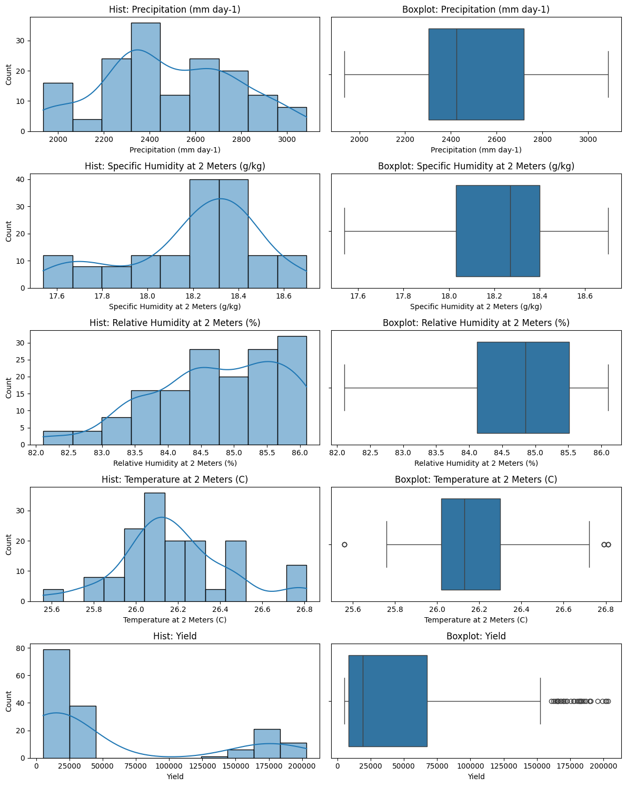
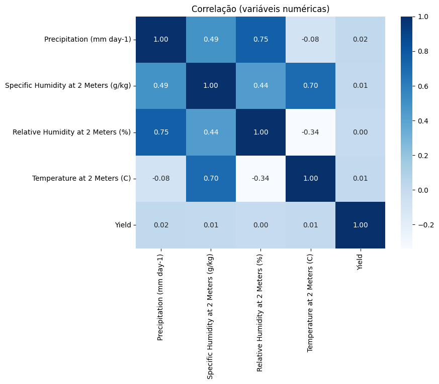
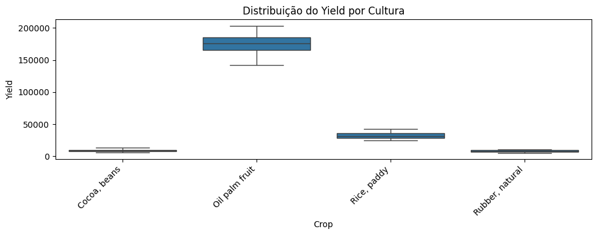
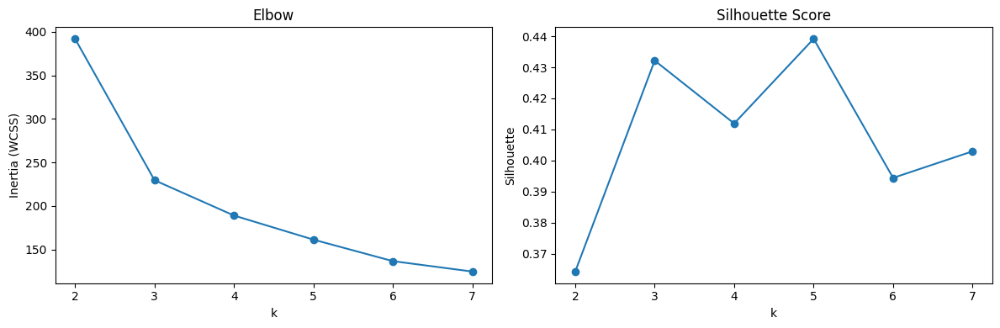
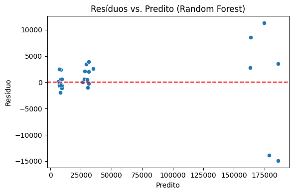
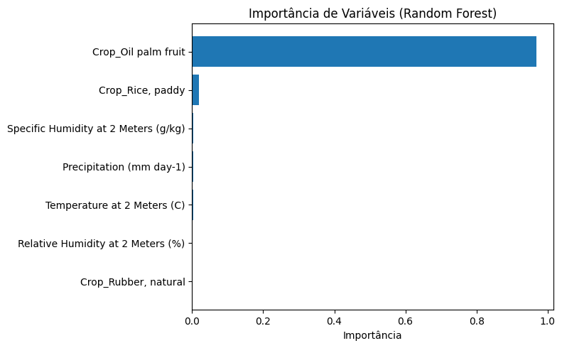
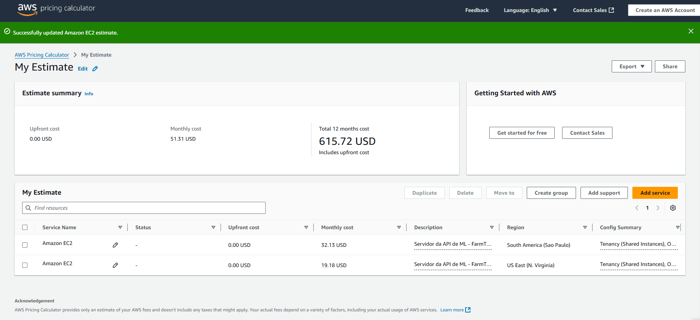

# FIAP - Faculdade de Informática e Administração Paulista

<p align="center">
<a href="https://www.fiap.com.br/"></a>
</p>

<br>

# FarmTech Solutions: Previsão de Rendimento Agrícola com Machine Learning

## Fase 5 – Capítulo 1  
Período: 04/08/2025 a 09/09/2025

## 👨‍🎓 Integrantes do Grupo 64:
- Deivisson Gonçalves Lima – RM565095 – [deivisson.engtele@gmail.com](mailto:deivisson.engtele@gmail.com)
- Omar Calil Abrão Mustafá Assem – RM561375 – [ocama12@gmail.com](mailto:ocama12@gmail.com)
- Paulo Henrique de Sousa – RM564262 – [pauloo.sousa16@outlook.com](mailto:pauloo.sousa16@outlook.com)
- Renan Danilo dos Santos Pereira – RM566175 – [renansantos4978@gmail.com](mailto:renansantos4978@gmail.com)

## 👩‍🏫 Professores:
### Tutor(a):
- Lucas Gomes Moreira  
### Coordenador(a):
- André Godoi Chiovato  

---

## 📜 Introdução

Nesta entrega, a FarmTech Solutions atua em uma fazenda de médio porte (200 hectares) para aplicar **Machine Learning** na análise de dados climáticos e agrícolas.  
O objetivo é prever o **rendimento da safra (Yield)** e identificar **tendências de produtividade** por meio de **clusterização**, de modo a apoiar a gestão agrícola com base em dados reais.

---

## 🔧 Entrega 1 – Desenvolvimento de Machine Learning

### 💡 Desafio
- Explorar e entender os dados fornecidos (EDA).  
- Aplicar **técnicas de clusterização** para identificar cenários de produtividade e possíveis outliers.  
- Construir **cinco modelos de regressão supervisionada** diferentes para prever o rendimento da safra.  
- Avaliar o desempenho por métricas como **RMSE, MAE e R²**.  
- Interpretar resultados, limitações e propor próximos passos.  

### 🧠 Soluções Aplicadas
- Bibliotecas: `pandas`, `numpy`, `seaborn`, `matplotlib`, `scikit-learn`.  
- **Clusterização**: K-Means (Elbow e Silhouette) e DBSCAN.  
- **Modelos preditivos**:
  - Regressão Linear
  - Árvore de Decisão
  - Random Forest
  - Gradient Boosting
  - SVR  
- **Validação**: Hold-out + Repeated K-Fold Cross-Validation.  
- **Interpretação**: Importância de variáveis e análise de resíduos.  

---

## 📊 Bases de Dados

As bases utilizadas estão disponíveis na pasta `/data/`:

- `crop_yield.csv` – base principal fornecida pela FIAP  
- `base_auxiliar_1.csv` – auxiliar  
- `base_auxiliar_2.csv` – auxiliar  

---

## 📈 Prints do Projeto

### 📊 Análise Exploratória
<p align="center">
  
</p>
<p align="center">
  
</p>

### 📉 Clusterização
<p align="center">
  
  
</p>

### 🤖 Modelagem Preditiva
<p align="center">
  
  
</p>

---

## ☁️ Entrega 2 – Hospedagem em AWS

Nesta etapa, simulamos o custo de hospedar a API da Machine Learning em instâncias **Amazon EC2** com configuração mínima:  

- 2 vCPUs  
- 1 GiB de memória  
- Rede até 5 Gbps  
- 50 GB de armazenamento (EBS)  
- Sistema: Linux  

### 🔎 Estimativa de Custos (On-Demand – 100%)
Usando a **AWS Pricing Calculator**, obtivemos os seguintes valores:

- **Região São Paulo (South America)**  
  - Custo mensal: **USD 32.13**  
  - Custo anual: **USD 385.56**  

- **Região Virgínia do Norte (US East)**  
  - Custo mensal: **USD 19.18**  
  - Custo anual: **USD 230.16**  

- **Resumo Total (comparativo)**  
  - São Paulo + Virgínia = **USD 51.31/mês**  
  - **USD 615.72/ano**  

<p align="center">
  
</p>

### 📌 Justificativa da Escolha
Apesar da **Virgínia do Norte** apresentar custo mais baixo, optamos pela **região de São Paulo (Brasil)** devido a dois fatores:
1. **Latência e desempenho** – acesso mais rápido aos dados dos sensores em território nacional.  
2. **Regulamentação** – restrições legais quanto ao armazenamento de dados sensíveis no exterior.  

Assim, o ambiente em **São Paulo** é a escolha recomendada, mesmo com custo superior.

---

## 📂 Estrutura de Pastas

```
📁Fase5_Cap1/
├─ 📜DeivissonGoncalvesLima_RM565095_fase5_cap1.ipynb
├─ 📜README.md
├─ 📂data/
│   ├─ crop_yield.csv
│   ├─ base_auxiliar_1.csv
│   └─ base_auxiliar_2.csv
├─ 📂imagens/
│   ├─ correlacao.png
│   ├─ distribuicao_yield.png
│   ├─ elbow.png
│   ├─ silhouette.png
│   ├─ comparacao_modelos.png
│   ├─ feature_importance.png
│   └─ CalculadoraAWS.png
├─ 📂assets/
│   └─ logo-fiap.png
```

---

## 🎥 Demonstração em Vídeo
- **Entrega 1 (ML):** [Link YouTube – não listado](https://youtu.be/PNoiHHMQ2aw)  
- **Entrega 2 (AWS):** [Link YouTube – não listado](https://youtube.com/...) *(a ser atualizado)*  

---

## 📜 Licença
Este projeto foi desenvolvido exclusivamente para fins acadêmicos no contexto da disciplina de Inteligência Artificial da FIAP.  
Todos os direitos reservados aos autores mencionados.
